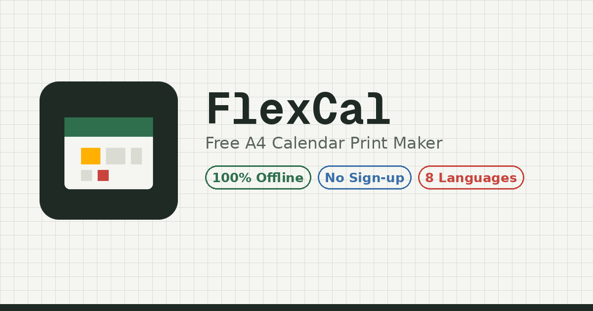

# FlexCal — Free A4 Calendar Print Maker

**🔗 [https://egoaid.github.io/FlexCal/](https://egoaid.github.io/FlexCal/)**

日程をマスに書き込んで、自分だけの自由レイアウトカレンダーをA4/US Letterで印刷できる、**無料・完全オフライン動作**のアプリです。サインアップ不要・広告なし・追跡なし。入力したデータはお使いの端末の中にだけ保存されます。

## 推奨環境について

FlexCalは**「印刷すること」自体がメイン機能**のアプリです。そのため、印刷機能をフルに使えるデスクトップ・ノートPCのブラウザでの利用を基本としています。

スマートフォンで予定を入力する分には問題なくお使いいただけますが、印刷する際もホーム画面に追加せず、**Safari・Chromeなどの通常のブラウザ画面のまま**ご利用ください。現時点ではPWA(ホーム画面に追加してアプリのように起動する形式)には完全に対応できておらず、特にiPhoneでホーム画面に追加した状態では印刷/PDF保存が正常に動作しません。詳しくは下記の「既知の制限」をご覧ください。

## 主な機能

- 自由なレイアウトでのカレンダー印刷(Googleカレンダーの印刷機能では実現できない、色・フォント・用紙サイズ・面付けなどを細かく調整可能)
- **面付け印刷(N-up)モード**:1枚のA4用紙を好きな行数×列数に分割し、それぞれに小さなカレンダーを詰め込んで印刷(手帳やシステム手帳に貼れるサイズに)
- 予定ごとに重要度・アイコンを設定可能
- 表示言語8言語(日本語・English・한국어・Deutsch・Français・Italiano・Español・简体中文)
- 祝日計算12ヶ国対応(日・米・英・独・仏・伊・西・加・豪・韓・中・台。韓国・中国・台湾の旧暦ベースの祝日にも対応)
- ICS/CSVのインポート・エクスポート、全データのJSONバックアップ・復元
- 配色プリセット・フォントプリセット・「マイプリセット」(自分の設定をまとめて保存)
- オフラインキャッシュ(Service Worker)。ただしホーム画面への追加は非推奨(下記「既知の制限」参照)

## 使い方

アプリを開いて予定を入力し、「プリント準備」から見た目を整えて印刷するだけです。詳しい使い方は、アプリ内の**使い方ガイド**(`manual.html`。編集画面のメニュー、またはプリントデザイン画面のヘッダーから開けます)をご覧ください。日本語・英語で全機能を解説しています。

## データとプライバシー

- 予定・タイトル・概要・すべての印刷設定・背景画像は、お使いのブラウザの**IndexedDB**(端末内のみ)に保存されます。
- サーバーは存在せず、入力データを外部へ送信するコードは含まれていません。
- フォントの取得のみ、Google Fonts CDNへの通信が(初回、またはキャッシュが切れた場合に)発生します。祝日の計算はすべてアプリ内で行われ、通信は発生しません。

## 既知の制限

- 対応している祝日は12ヶ国(日・米・英・独・仏・伊・西・加・豪・韓・中・台)です。それ以外の国・地域や、国・地域内でも州や地方ごとに異なる祝日には対応していません。
- 国会・議会の特別法による一回限りの祝日移動(オリンピック特例、即位関連の一日限りの祝日など)には対応していません。
- ICSインポートは繰り返し予定(RRULE)に対応していません。
- スマホでの複数日一括選択(範囲ドラッグ)、および面付け印刷モードのマス境界ドラッグは、現状PC向けのマウス操作のみ対応です。
- **PWA(ホーム画面への追加)には完全対応できていません。** 特にiPhoneでホーム画面に追加した状態(standalone表示)で起動すると、iOS側の既知の制限により「印刷 / PDF保存」ボタンが機能しません。これはFlexCal側の不具合ではなく、iOSのホーム画面アプリにおける`window.print()`まわりの、長年未修正のOS側の制限です。印刷する場合は、ホーム画面のアイコンからではなく、Safariなど通常のブラウザでFlexCalを開いてご利用ください。

## ライセンス

© 2026 egoaid. 詳細は [LICENSE](./LICENSE) を参照してください。ソースコードは All rights reserved(権利留保)です。アプリ自体はウェブサイト経由で無料でご利用いただけますが、ソースコードの複製・改変・再配布等には著作権者の許諾が必要です。
